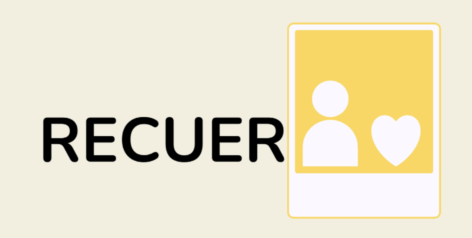
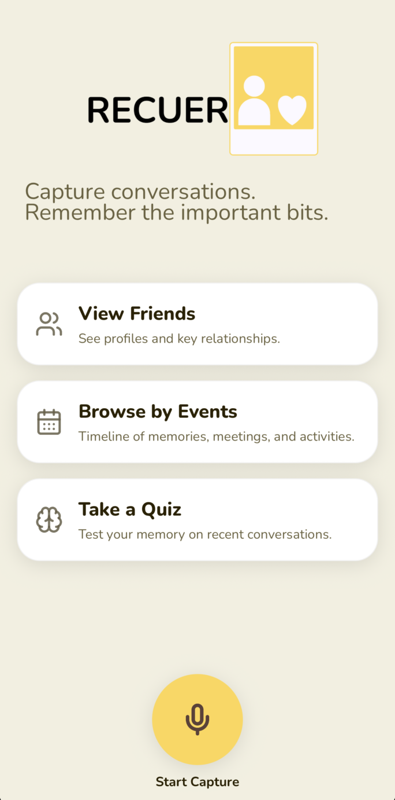
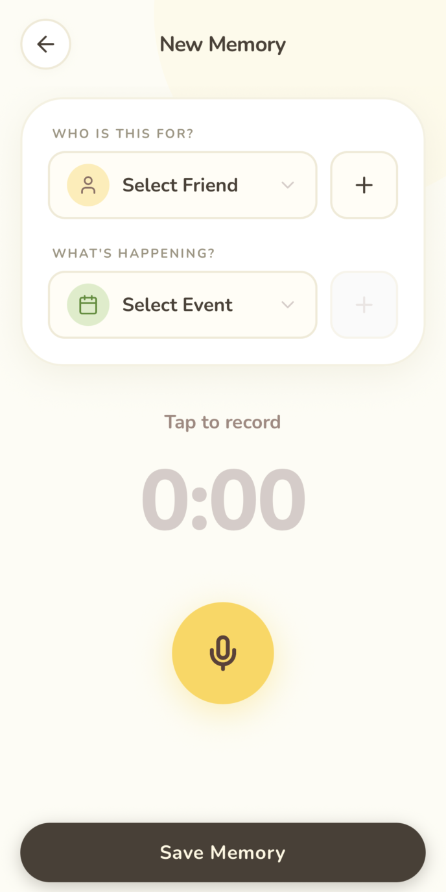
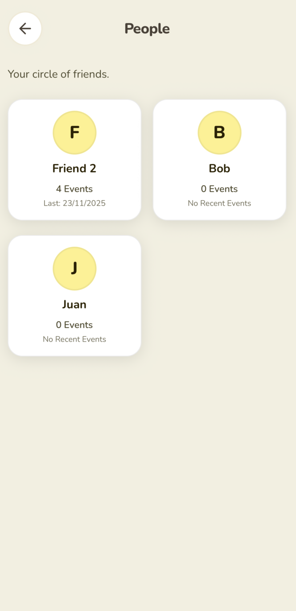
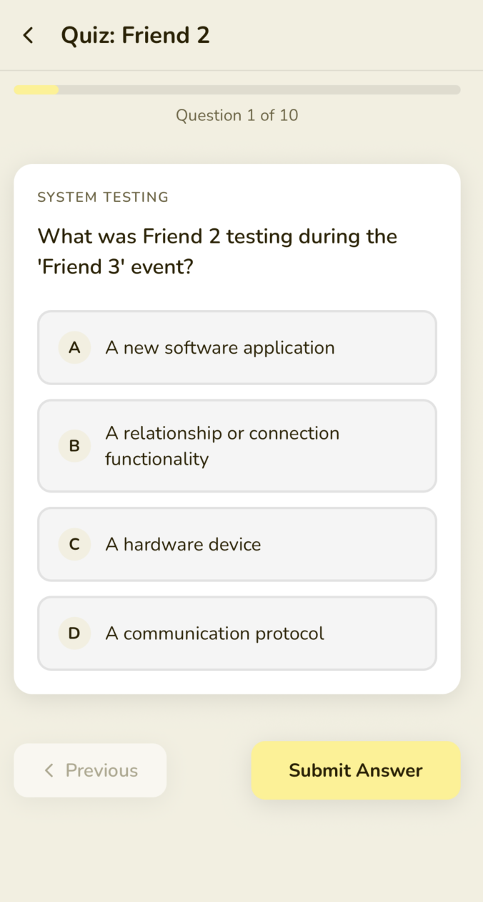

**Your AI-Powered Social Memory Assistant**

> *Never forget the details that matter. Deepen your connections.*

Recuerdo is a mobile application designed to help you remember the important details from your conversations with friends and family. By capturing audio moments, Recuerdo uses advanced AI to transcribe, analyze, and organize your social interactions, ensuring you never lose track of the small things that make relationships special.

## 📱 Screenshots

| Home Screen | Capture Memory | People | Quiz |
|:---:|:---:|:---:|:---:|
| | |  | |

## 🚀 Key Features

- **🎙️ Audio Capture & Transcription**: Think aloud and capture your moments before you lose it. 
- **🧠 Intelligent Analysis**: We use Anthropic's Claude 3.5 Sonnet to extract key details and summarize events from your recordings.
- **📅 Event Timeline**: visualizes your social history, showing you when and where you made memories.
- **❓ Memory Quizzes**: Gamified quizzes generated from your actual conversations to help you retain important details about your friends and loved ones.

## 🛠️ Tech Stack

**Frontend (Mobile App)**
- **Framework**: [React Native](https://reactnative.dev/) with [Expo](https://expo.dev/) (Expo Router)
- **Language**: TypeScript
- **Styling**: Custom StyleSheet with a warm, premium design system (Nunito font family)
- **Icons**: Lucide React Native

**Backend (API)**
- **Framework**: [FastAPI](https://fastapi.tiangolo.com/) (Python)
- **Database**: [Supabase](https://supabase.com/) (PostgreSQL)
- **AI/ML**:
  - **Transcription**: [Deepgram Nova-2](https://deepgram.com/)
  - **Intelligence**: [Anthropic Claude 3.5 Sonnet](https://www.anthropic.com/)

## 💡 Inspiration

In a fast-paced world, it's easy to let meaningful details slip through the cracks. We built Recuerdo to bridge the gap between experiencing a moment and remembering it forever. It's not just about recording audio; it's about cherishing the people in our lives.

---

*Built with ❤️ for the Hackathon*
